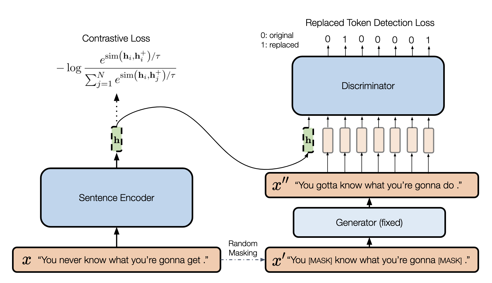

# DiffCSE: Difference-based Contrastive Learning for Sentence Embeddings

[](https://img.shields.io/badge/Version-v0.1.0-blue)
[](https://opensource.org/licenses/MIT)
[](https://arxiv.org/abs/2204.10298)
[](https://huggingface.co/voidism)
[](https://github.com/huggingface/transformers)
[](https://twitter.com/YungSungChuang/status/1517518077902000129)
[](https://github.com/voidism/DiffCSE/stargazers)

[](https://colab.research.google.com/github/voidism/DiffCSE/blob/master/diffcse_evaluation.ipynb)

arXiv link: https://arxiv.org/abs/2204.10298  
To be published in [**NAACL 2022**](https://2022.naacl.org/)

Authors:
[Yung-Sung Chuang](https://people.csail.mit.edu/yungsung/), 
[Rumen Dangovski](http://super-ms.mit.edu/rumen.html),
[Hongyin Luo](http://people.csail.mit.edu/hyluo/),
[Yang Zhang](https://mitibmwatsonailab.mit.edu/people/yang-zhang/),
[Shiyu Chang](https://code-terminator.github.io/),
[Marin Soljačić](http://www.mit.edu/~soljacic/marin.html),
[Shang-Wen Li](https://swdanielli.github.io/),
[Scott Wen-tau Yih](https://scottyih.org/),
[Yoon Kim](https://people.csail.mit.edu/yoonkim/),
[James Glass](http://groups.csail.mit.edu/sls/people/glass.shtml)


Our code is mainly based on the code of [SimCSE](https://arxiv.org/abs/2104.08821). Please refer to their [repository](https://github.com/princeton-nlp/SimCSE) for more detailed information.

## Overview


We propose DiffCSE, an unsupervised contrastive learning framework for learning sentence embeddings. DiffCSE learns sentence embeddings that are sensitive to the difference between the original sentence and an edited sentence, where the edited sentence is obtained by stochastically masking out the original sentence and then sampling from a masked language model. We show that DiffSCE is an instance of equivariant contrastive learning [(Dangovski et al., 2021)](https://arxiv.org/abs/2111.00899), which generalizes contrastive learning and learns representations that are insensitive to certain types of augmentations and sensitive to other "harmful" types of augmentations. Our experiments show that DiffCSE achieves state-of-the-art results among unsupervised sentence representation learning methods, outperforming unsupervised SimCSE by 2.3 absolute points on semantic textual similarity tasks. 

## Setups

[](https://www.python.org/downloads/release/python-395/)
[](https://pytorch.org/get-started/previous-versions/)

### Requirements
* Python 3.9.5

### Install our customized Transformers package
```
cd transformers-4.2.1
pip install .
```
> If you have already installed `transformers==4.2.1` through pip, you need to put `modeling_bert.py` into `<your_python_env>/site-packages/transformers/models/bert/modeling_bert.py` and `modeling_roberta.py` into `<your_python_env>/site-packages/transformers/models/bert/modeling_roberta.py`.
> We modify these two files in the package so that we can perform _conditional_ pretraining tasks using BERT/RoBERTa. If possible, please directly pip install our customized Transformers package.

### Install other packages
```
pip install -r requirements.txt
```

### Download the pretraining dataset
```
cd data
bash download_wiki.sh
```

### Download the downstream dataset
```
cd SentEval/data/downstream/
bash download_dataset.sh
```

## Training
(The same as `run_diffcse.sh`.)
```bash
python train.py \
    --model_name_or_path bert-base-uncased \
    --train_file data/wiki1m_for_simcse.txt \
    --output_dir <your_output_model_dir> \
    --num_train_epochs 2 \
    --per_device_train_batch_size 64 \
    --learning_rate 7e-6 \
    --max_seq_length 32 \
    --evaluation_strategy steps \
    --metric_for_best_model stsb_spearman \
    --load_best_model_at_end \
    --eval_steps 125 \
    --pooler_type cls \
    --mlp_only_train \
    --overwrite_output_dir \
    --logging_first_step \
    --logging_dir <your_logging_dir> \
    --temp 0.05 \
    --do_train \
    --do_eval \
    --batchnorm \
    --lambda_weight 0.005 \
    --fp16 --masking_ratio 0.30
```

Our new arguments:
* `--lambda_weight`: the lambda coefficient mentioned in Section 3 of our paper.
* `--masking_ratio`: the masking ratio for MLM generator to randomly replace tokens.


Arguments from [SimCSE](https://github.com/princeton-nlp/SimCSE):
* `--train_file`: Training file path (`data/wiki1m_for_simcse.txt`). 
* `--model_name_or_path`: Pre-trained checkpoints to start with such as BERT-based models (`bert-base-uncased`, `bert-large-uncased`, etc.) and RoBERTa-based models (`RoBERTa-base`, `RoBERTa-large`).
* `--temp`: Temperature for the contrastive loss. We always use `0.05`.
* `--pooler_type`: Pooling method.
* `--mlp_only_train`: For unsupervised SimCSE or DiffCSE, it works better to train the model with MLP layer but test the model without it. You should use this argument when training unsupervised SimCSE/DiffCSE models.

For the results in our paper, we use a NVidia 2080Ti GPU with CUDA 11.2. Using different types of devices or different versions of CUDA/Python/PyTorch may lead to slightly different performance.

## Evaluation

 
[](https://colab.research.google.com/github/voidism/DiffCSE/blob/master/diffcse_evaluation.ipynb)  
We provide a simple colab notebook to reproduce our results easily. We can also run the commands below for evaluation:

```bash
python evaluation.py \
    --model_name_or_path <your_output_model_dir> \
    --pooler cls_before_pooler \
    --task_set <sts|transfer|full> \
    --mode test
```

To evaluate our pretrained DiffCSE checkpoints, we can use the following scripts:

### BERT 
#### STS

```bash
python evaluation.py \
    --model_name_or_path voidism/diffcse-bert-base-uncased-sts \
    --pooler cls_before_pooler \
    --task_set sts \
    --mode test
```
#### Transfer Tasks

```bash
python evaluation.py \
    --model_name_or_path voidism/diffcse-bert-base-uncased-trans \
    --pooler cls_before_pooler \
    --task_set transfer \
    --mode test
```

### RoBERTa 
#### STS

```bash
python evaluation.py \
    --model_name_or_path voidism/diffcse-roberta-base-sts \
    --pooler cls_before_pooler \
    --task_set sts \
    --mode test
```
#### Transfer Tasks

```bash
python evaluation.py \
    --model_name_or_path voidism/diffcse-roberta-base-trans \
    --pooler cls_before_pooler \
    --task_set transfer \
    --mode test
```

For more detailed information, please check [SimCSE's GitHub repo](https://github.com/princeton-nlp/SimCSE).


## Pretrained models

[](https://huggingface.co/voidism)

* DiffCSE-BERT-base (STS): https://huggingface.co/voidism/diffcse-bert-base-uncased-sts
* DiffCSE-BERT-base (transfer tasks): https://huggingface.co/voidism/diffcse-bert-base-uncased-trans
* DiffCSE-RoBERTa-base (STS): https://huggingface.co/voidism/diffcse-roberta-base-sts
* DiffCSE-RoBERTa-base (transfer tasks): https://huggingface.co/voidism/diffcse-roberta-base-trans

We can load the models using the API provided by [SimCSE](https://github.com/princeton-nlp/SimCSE). 
See [Getting Started](https://github.com/princeton-nlp/SimCSE#getting-started) for more information.

```python
from diffcse import DiffCSE
model_bert_sts = DiffCSE("voidism/diffcse-bert-base-uncased-sts")
model_bert_trans = DiffCSE("voidism/diffcse-bert-base-uncased-trans")
model_roberta_sts = DiffCSE("voidism/diffcse-roberta-base-sts")
model_roberta_trans = DiffCSE("voidism/diffcse-roberta-base-trans")
```

## Citations

[](https://doi.org/10.48550/arXiv.2204.10298)

Please cite our paper and the SimCSE paper if they are helpful to your work!

```bibtex
@inproceedings{chuang2022diffcse,
   title={{DiffCSE}: Difference-based Contrastive Learning for Sentence Embeddings},
   author={Chuang, Yung-Sung and Dangovski, Rumen and Luo, Hongyin and Zhang, Yang and Chang, Shiyu and Soljacic, Marin and Li, Shang-Wen and Yih, Wen-tau and Kim, Yoon and Glass, James},
   booktitle={Annual Conference of the North American Chapter of the Association for Computational Linguistics (NAACL)},
   year={2022}
}

@inproceedings{gao2021simcse,
   title={{SimCSE}: Simple Contrastive Learning of Sentence Embeddings},
   author={Gao, Tianyu and Yao, Xingcheng and Chen, Danqi},
   booktitle={Empirical Methods in Natural Language Processing (EMNLP)},
   year={2021}
}
```
